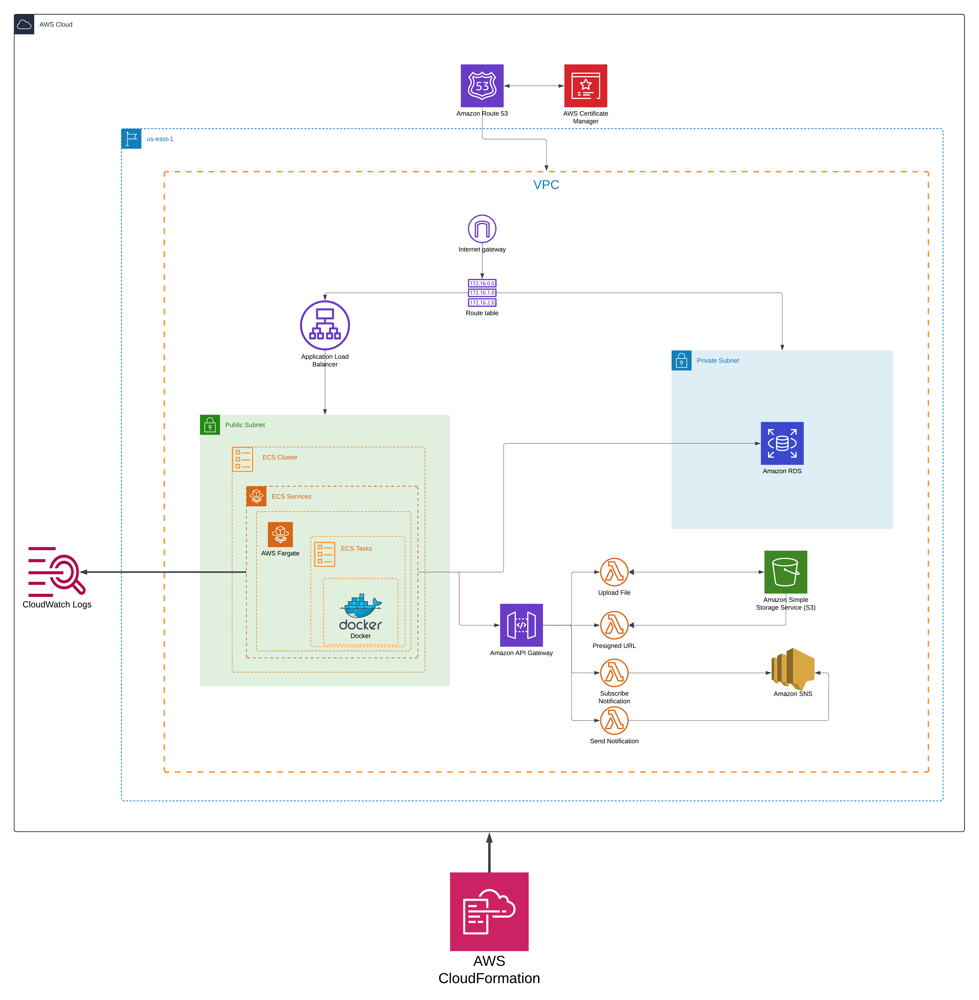

# Revisions

## Introduction
Revisions is a web app simplifying change log management for software projects. Users create organizations, post detailed logs, and collaborate effortlessly. Each organization has a unique subdomain for easy sharing. Deployed on AWS using CloudFormation, it ensures scalability and reliability with ECS, ELB, API Gateway, Lambda, SNS, CloudFront, and S3 services.

## Objective and Purpose

- __Centralized Change Log Management:__ Revisions aims to provide a centralized platform for development teams and contributors to document and share detailed change logs for their projects.
- __Enhanced Collaboration:__ By maintaining a clear and accessible history of changes, Revisions enable better collaboration among team members and stakeholders.
- __User-Friendly Interface:__ The platform offers a user-friendly editor that supports various content formats such as images, code snippets, and styling options, eliminating the need for manual formatting such as writing in markdown.
- __Organization Subdomains:__ Each organization created on Revisions gets a unique subdomain, allowing users to easily share their change logs with project stakeholders.

## Target Audience
Revisions targets project developers, development teams, open-source contributors, and anyone involved in software development who needs to communicate and track changes effectively. The platform caters to both individual developers and organizations seeking to maintain transparent and accessible change logs.

## Performance Targets
For the performance targets, the website and its architecture are designed to handle a large number of users with the help distributed system deployed across AWS ECS with load balancing provided by ELB (Elastic Load Balancing). This ensures that in the event of high usage, the application can scale up as needed for seamless scaling and fault tolerance. Scalability is managed effectively using AWS services such as S3 for scalable storage of images and CloudFront for content delivery, optimizing data retrieval and minimizing latency.

## Final Architecture
Revision’s final architecture integrates various AWS services to deliver comprehensive, scalable, and reliable application for managing and automating change logs for developers. Here’s how the cloud mechanisms work together in this architecture:

1. __ECS (Elastic Container Service)__ hosts the application containers by getting the image from dockerhub allowing for easy scaling and management of application instances.
2. __ELB (Elastic Load Balancer)__ distributes incoming application traffic across multiple ECS instances, ensuring reliability and enhancing performance.
3. __Lambda__ is used for executing a separate process such as sending update emails on their account. Once the user creates the post, the publish and live link is sent. Also, when the organization is created, getting started steps are sent to the email with the subdomain too.
4. __API Gateway__ acts as the front door for sending emails. It's integrated with Lambda to process these requests efficiently and invoke SNS.
5. __S3 (Simple Storage Service)__ stores static assets such as images. It provides durability, availability, and scalability for hosting user-uploaded content.
6. __CloudFront__ delivers the application's static assets (Images) stored in S3 buckets quickly to users worldwide, reducing latency.
7. __Route 53__ manages the application's DNS records, including the provisioning of a subdomain for each developer or team to access their change logs.
8. __SNS (Simple Notification Service)__ sends notifications to users about updates or changes to their change logs.
9. __Postgres Database__ A serverless PostgreSQL database provided using Neon tech is used to store the posts data, organizations, accounts and all other data, other than the images.

- Data Storage:
1. __Static Assets (Images)__ Data such as images uploaded by users is stored in Amazon S3 (Simple Storage Service). S3 provides durable and scalable object storage, ensuring that static assets are securely stored and accessible.

For deploying the project, I have containerized it using docker. Using a docker file, I built an image and hosted it on the docker hub. Now, a task is created in ECS as a service, which takes the image and hosts it. Load balancing is also integrated using the AWS ELB, which forwards the request to the target group which has ECS and its tasks. The Lambda functions are deployed in AWS lambda which can be reached using the API gateway. The Lambda functions trigger the SNS topic. The full system is deployed to AWS using __CloudFormation__, which allows for the infrastructure to be defined as code. This __IaC (Infrastructure as Code)__ approach automates and standardizes the deployment, ensuring consistency across environments